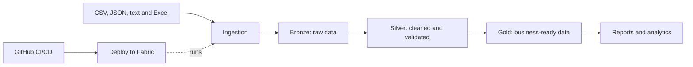

```mermaid
flowchart LR
    A["CSV, JSON, text and Excel"] --> B["Ingestion"]
    B --> C["Bronze: raw data"]
    C --> D["Silver: cleaned and validated"]
    D --> E["Gold: business-ready data"]
    E --> F["Reports and analytics"]
    G["GitHub CI/CD"] --> H["Deploy to Fabric"]
    H -. runs .-> B
```

